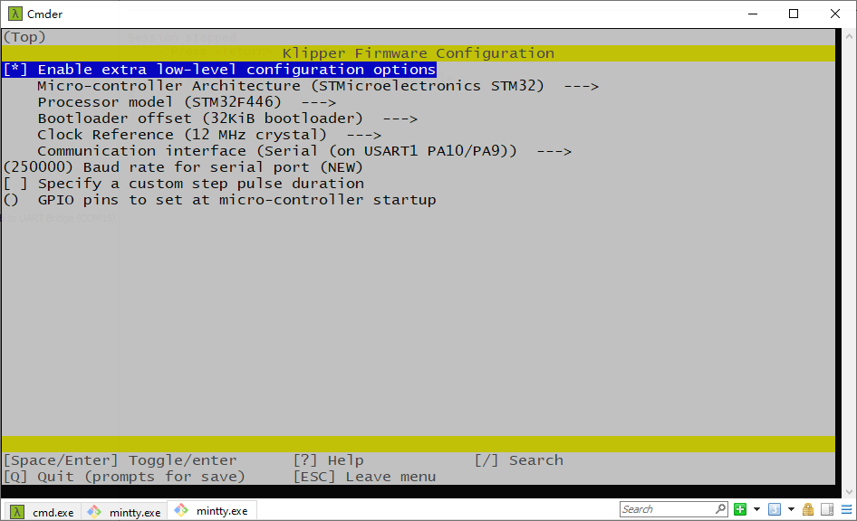

# Firmware

We use `Spider v2.2` motherboard ([github](https://github.com/FYSETC/FYSETC-SPIDER)) for our `Voron-2` kit. And we use `Klipper` firmware. You can get the pre-build firmware `klipper.bin` and `printer_300.cfg` and `printer_350.cfg` files beside this `README` file.  In the kit you should find an SD card with OctoPi OS flashed. After you build your Voron Trident machine, you can insert it to the Raspberry-Pi and power up the machine, the machine should work. Remember to connect Ethernet cable to Raspberry-Pi and connect Spider board to Raspberry-Pi with 2*5 cable set.  

## 1. Klipper 

### 1.1 compile: menuconfig

We use the following `make menuconfig` below to compile Klipper. You can check more firmware build information on our Spider board github page [here](https://github.com/FYSETC/FYSETC-Cheetah#klipper) and gitee page [here](https://gitee.com/fysetc-mirrors/FYSETC-Cheetah#53-upload-the-firmware).



### 1.2 klipper.bin

This is pre-build firmware for our Trident kit, you can just use it. But if you update our pre-flash OctoPi OS or you use your own Raspberry-Pi OS, please build the Klipper firmware yourself.

### 1.3 How to upload firmware to Spider

Please follow the instruction [here](https://github.com/FYSETC/FYSETC-SPIDER#44--firmware-upload) (Firmware Upload sector).

## 2. OctoPi OS

We flashed an SD card with OctoPi OS, the account and password are below.

### 2.1 Account and password

Octoprint account and password

```
Account: FYSETC
Password: 12345678
```

OS SSH login account and password

```
Account: pi
Password: raspberry
```

### 2.2 Connect Raspberry-Pi UART

We connect RPI and Spider on UART interface of this kit, so if you build your own RaspberryPi OS ,you need to follow the link [here](https://github.com/FYSETC/FYSETC-SPIDER/blob/main/firmware/Klipper/Connect%20RPI%20uart.md). On the pre-flashed OctoPi OS on the SD card, we already did this for you, so you only need to connect 2*5 cable set. 

### 2.3 OctoPi OS

We also provide you this Octopi system image for you. The Spider board version in the kit is v2.2, and you can get the responding Octopi system here

350mm kit ([1.Dropbox](https://www.dropbox.com/s/c5qx55i420vnvi0/Voron-Trident-octoprint-klipper-spider2.2-350mm.img?dl=0) 2.百度云盘 提取码：YYDS).

300mm kit ([1.Dropbox](https://www.dropbox.com/s/u9pus4t5mptj1d8/Voron-Trident-octoprint-klipper-spider2.2-300mm.img?dl=0) 2.百度云盘 提取码：YYDS).

Just flash it to your SD card, and all are ready there.

### 2.4 how to flash

Before flash, you need an SD card , minimum requirement of SD card capacity is 8G. Please prepare that first. And then you can use this software [here](https://www.balena.io/etcher/) to install. Well that are so many OS flash tool that you can use. And there are a lot of tutorial if you google `how to flash os image`.

