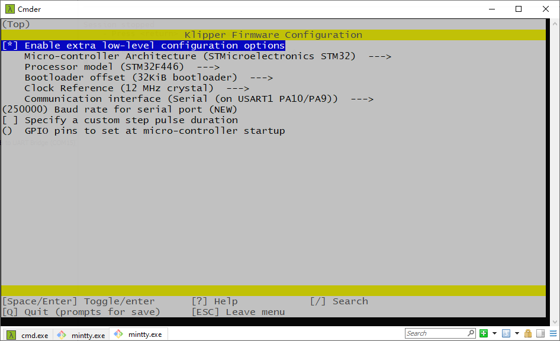

# Firmware

We use `Spider v2.2` motherboard ([github](https://github.com/FYSETC/FYSETC-SPIDER)) for our `Voron-0` kit. And we use `Klipper` firmware. You can get the pre-build firmware `klipper.bin` and `printer_300.cfg` and `printer_350.cfg` files beside this `README` file.  In the kit you should find an SD card with OctoPi OS flashed. After you build your Voron Trident machine, you can insert it to the Raspberry-Pi and power up the machine, the machine should work. Remember to connect Ethernet cable to Raspberry-Pi and connect Spider board to Raspberry-Pi with 2*5 cable set.  

## 1. OctoPi OS

We flashed an SD card with OctoPi OS, the account and password are below.

### 1.1 Account and password

Account: FYSETC

Password: 12345678

### 1.2 Connect Raspberry-Pi UART

We connect RPI and Spider on UART interface of this kit, you can follow link [here](https://github.com/FYSETC/FYSETC-SPIDER/blob/main/firmware/Klipper/Connect%20RPI%20uart.md). On the pre-flashed OctoPi OS on the SD card, we already did this for you, so you only need to connect 2*5 cable set.

## 2. Klipper compile

### 2.1 menuconfig

We use the following `make menuconfig` below to compile Klipper. You can check more firmware build information on our Spider board github page [here](https://github.com/FYSETC/FYSETC-Cheetah#klipper).

### 2.2 klipper.bin

This is pre-build firmware for our Trident kit, you can just use it. But if you update our pre-flash OctoPi OS or you use your own Raspberry-Pi OS, please build the Klipper firmware yourself.

## 3. How to upload firmware to Spider

Please follow the instruction [here](https://github.com/FYSETC/FYSETC-SPIDER#44--firmware-upload) (Firmware Upload sector).

