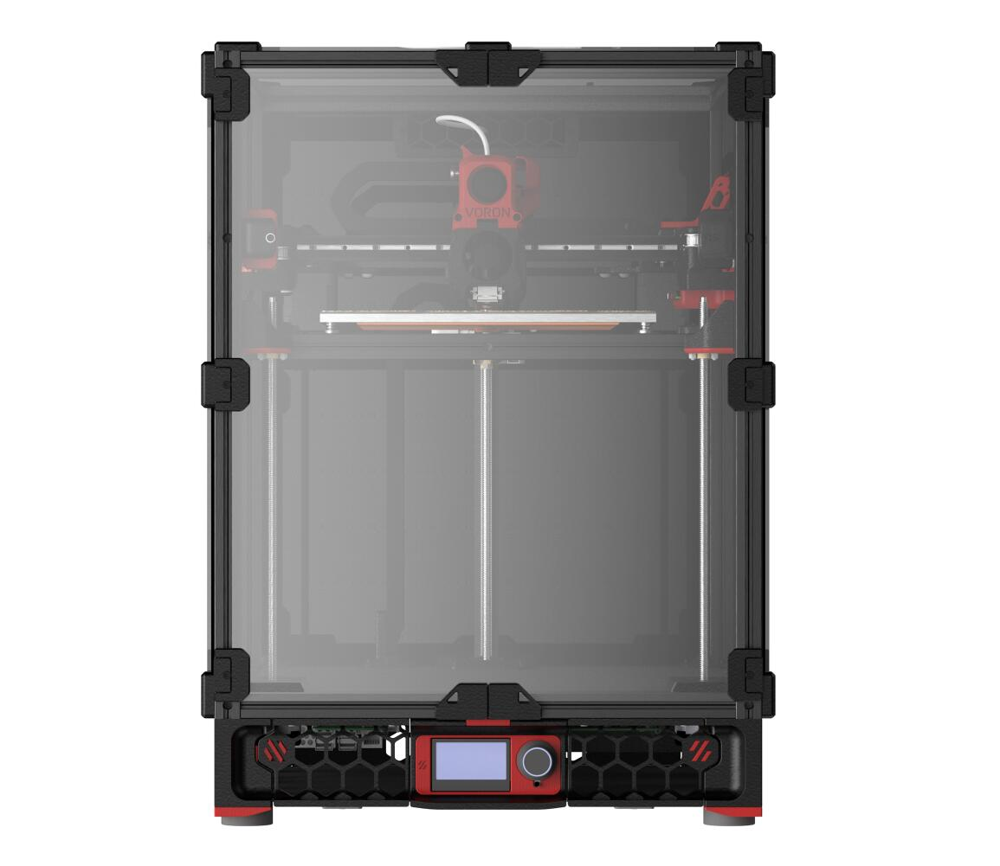
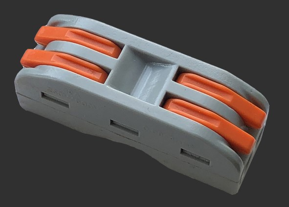
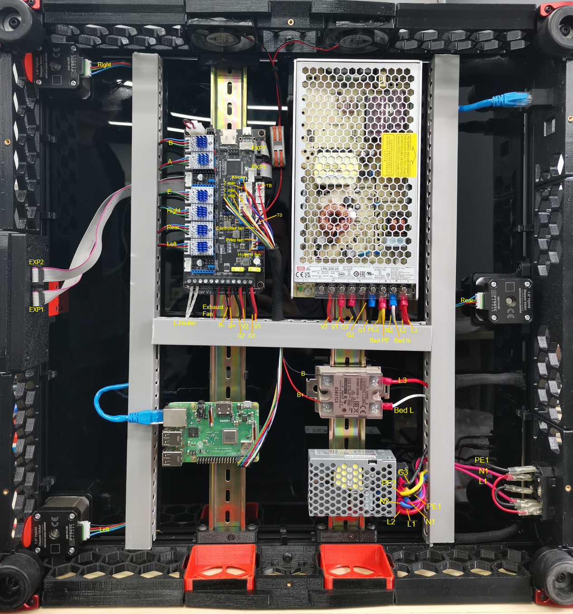

# FYSETC-Voron-Trident



## 1. Project

This is FYSETC's project database for VORON Trident kit, which is convenient for you to find information. Thanks for VORON Team's great work, they always design fantastic printers.

Official website:：https://vorondesign.com/voron_trident
Official Github：https://github.com/VoronDesign/Voron-Trident

In folder `Voron-Trident` beside this README file, we make some small changes base on the VORON official material. Like change the board to Spider and others. 

## 2. BOM

Please check [here](https://github.com/FYSETC/FYSETC-Voron-Trident/blob/main/BOM.md).

## 3. Connectors

### Wire connector




This is for fans wire connection, with this connector you can wire two or more fans to one side of the connector, and the other side  to Spider board. Then you can control the two or more fans with one control pin in Spider.

## 4. Printed parts

You can find all printed parts in VORON [website](https://vorondesign.com/voron_trident), VORON [github](https://github.com/VoronDesign/Voron-Trident) .

Printed parts are not included in our VORON Trident kit, in some particular section of the machine, VORON provide you options. Like the plug panel at the back of VORON machine, you can choose [plug_panel](https://github.com/VoronDesign/Voron-Trident/blob/main/STLs/Skirt/power_inlet_adamstech.stl) . So in our kit, we also need to choose too, below is our choice.

plug panel: we choose this [one](https://github.com/VoronDesign/Voron-Trident/blob/main/STLs/Skirt/power_inlet_adamstech.stl).

Microswitch edge pod : this [one](https://github.com/VoronDesign/VoronUsers/blob/master/printer_mods/randell/Microswitch_Endstop/Microswitch_Edge_Pod.stl).

Z Chain mount: Chain size is 1011 ,it is bridge can be opened, so we use our own printed part [1](https://github.com/VoronDesign/Voron-Trident/blob/main/STLs/Gantry/X_Axis/XY_Joints/%5Ba%5D_xy_joint_cable_bridge_3hole.stl) 、 [2](https://github.com/VoronDesign/Voron-Trident/blob/main/STLs/Gantry/X_Axis/X_Carriage/Direct%20Feed/chain_anchor_3hole.stl) and [3](https://github.com/VoronDesign/Voron-Trident/blob/main/STLs/Gantry/X_Axis/X_Carriage/Direct%20Feed/chain_anchor_3hole.stl). 

Spider board mount: search 'Spider' [here](https://github.com/VoronDesign/Voron-Trident/blob/main/STLs/ElectronicsBay/Controller_Mounts/Spider_bracket_2pc.stl).

## 5. Wiring

### 5.1 Wiring diagram

This our Spider v2.2 wiring diagram for our Trident kit. Or you can refer Spider wiring [here](https://github.com/FYSETC/FYSETC-SPIDER#3-hardware-guide).

***Note: Check your fan voltage before you set the fan jumpers, the jumpers for fan in below diagram are all set to 24v.***


### 5.2 Wiring example

Following is the our wiring example. If it is not clear enough, you can find `Wiring_Example.svg` beside this `README` to have a detail look. Note that we connect Klicky to `Y+` port, so we connect A and B endstop to `X-` and `Y-`, so it is different from the upper wiring diagram `VORON_Trident_Spider_v22_Wiring`. 



## 6. Firmware&OS

You can check firmware `README.md` in `Firmware&OS` folder beside this `README.md` file [here](https://github.com/FYSETC/FYSETC-Voron-Trident/tree/main/Firmware&OS). Well we already flashed Octopi system (on sdcard) and Spider board (Klipper firmware) for you before the kit leave the factory. Below is the pre-flashed OctoPi system account and password.

### 6.1 OctoPi

Octoprint account and password

```
Account: FYSETC
Password: 12345678
```

Also we provide you Octopi OS system image for you, please check the `README` in `Firmware&OS` folder.

OS SSH login account and password

```
Account: pi
Password: raspberry
```

## 7. Where to buy

[Aliexpress](https://www.aliexpress.com/item/1005003561028866.html?spm=5261.ProductManageOnline.0.0.2fc44edf4wYMCI)
